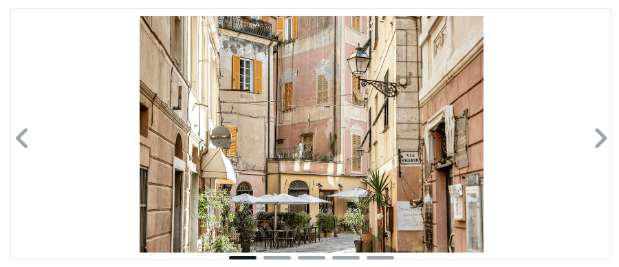

# Overview

The Carousel component is a UI element designed to display a dynamic array of Stylebox components.

## Carousel

the icon displayed in the button used for navigating to the next item
Customizable carousel component for seamlessly presenting a variety of content in an interactive format.


## Properties

| Name                | Type    | Default            | Description                                                                                           |
| ------------------- | ------- | ------------------ | ----------------------------------------------------------------------------------------------------- |
| `Slides to display` | Number  | `3`                | Determines the number of items you want to display per slide.                                         |
| `Loop`              | Boolean | `true`             | Determines whether the carousel should loop back to the beginning after reaching the last item.       |
| `Dots`              | Boolean | `true`             | Specifies whether to display navigation dots at the bottom of the carousel.                           |
| `Arrows`            | Boolean | `true`             | Controls the visibility of arrow buttons for navigating to the next or previous item in the carousel. |
| `Direction`         | String  | `ltr`              | Defines the direction of the carousel. Choose from `rtl`, `ltr`.                                      |
| `Orientation`       | String  | `x`                | Specifies the orientation of the carousel movement. Choose from `x`, `y`.                             |
| `Auto play`         | Boolean | `true`             | Determines whether the carousel automatically advances to the next item at a predefined interval.     |
| `Next button`       | Icon    | `fa-chevron-right` | The icon displayed in the button used for navigating to the next item.                                |
| `Previous button`   | Icon    | `fa-chevron-left`  | The icon displayed in the button used for navigating to the previous item.                            |

## DataSource

| Name       | Type             | Description                                                                    |
| ---------- | ---------------- | ------------------------------------------------------------------------------ |
| Datasource | Entity Selection | Entity selection that serves as the source of data for the Carousel component. |

## Custom CSS


```css
/* Container for slides */
self .carousel_container {
  overflow: hidden;
  border: 1px solid #ccc;
}

/* Individual slide */
self .carousel_slide {
  width: 100%;
}

/* Carousel buttons */
self .carousel_button {
  position: absolute;
  top: 50%;
  transform: translateY(-50%);
  background-color: rgba(0, 0, 0, 0.5);
  color: #f0f0f0;
  border: none;
  padding: 5px;
  cursor: pointer;
  transition: background-color 0.3s;
}

/* Carousel buttons on hover */
self .carousel_button:hover {
  background-color: rgba(0, 0, 0, 0.7);
}

/* Carousel dots */
self .carousel_dots {
  position: absolute;
  bottom: 2px;
  left: 50%;
  transform: translateX(-50%);
}

self .carousel_dot {
  width: 10px;
  height: 10px;
  background-color: #bbb;
  border-radius: 50%;
  display: inline-block;
  margin: 0 5px;
  cursor: pointer;
  transition: background-color 0.3s;
}

/* Carousel dots */
self .carousel_dot.active {
  background-color: #b22222;
}
```

## TODO

Orientation && Direction:rtl
